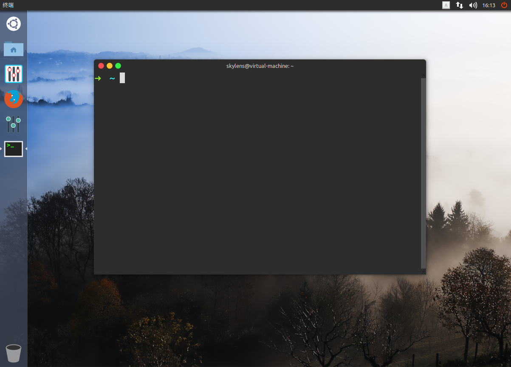
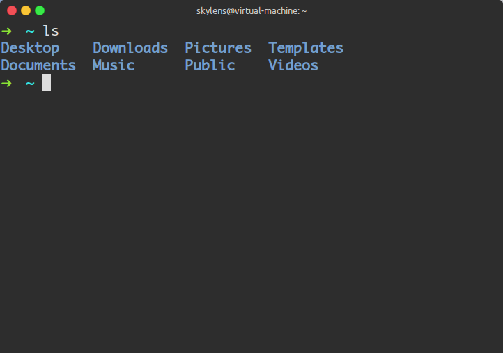

# Ubuntu/Debian

## Ubuntu/Debian 桌面版的相关设置

### Ubuntu 16.04 个人设置

1.网络设置

```bash
$ sudo dhclient eth0    # 通过DHCP获取IP地址
$ ping -c 3 www.136.com    # 测试网络连通性
```

2.添加源(这里添加[USTC](https://lug.ustc.edu.cn/wiki/mirrors/help/ubuntu)的源，这样会快一点)

```bash
$ sudo nano /etc/apt/sources.list

deb http://mirrors.ustc.edu.cn/ubuntu/ xenial main restricted universe multiverse
deb-src http://mirrors.ustc.edu.cn/ubuntu/ xenial main restricted universe multiverse
deb http://mirrors.ustc.edu.cn/ubuntu/ xenial-security main restricted universe multiverse
deb-src http://mirrors.ustc.edu.cn/ubuntu/ xenial-security main restricted universe multiverse
deb http://mirrors.ustc.edu.cn/ubuntu/ xenial-updates main restricted universe multiverse
deb-src http://mirrors.ustc.edu.cn/ubuntu/ xenial-updates main restricted universe multiverse
deb http://mirrors.ustc.edu.cn/ubuntu/ xenial-backports main restricted universe multiverse
deb-src http://mirrors.ustc.edu.cn/ubuntu/ xenial-backports main restricted universe multiverse
...
$ sudo apt-get update
```

3.安装常用软件([常用软件列表](https://raw.githubusercontent.com/skylens/ubuntu/master/apt-mark_showmanual.ubuntu16.04))

```bash
$ sudo apt-get install wget
$ wget https://raw.githubusercontent.com/skylens/ubuntu/master/apt-mark_showmanual.ubuntu16.04
$ sudo apt-get install `cat apt-mark_showmanual.ubuntu16.04`
```

4.删除不常用的软件

```bash
$ sudo apt-get remove --purge libreoffice*    #删除 Libreoffice
$ sudo apt-get remove unity-webapps-common    #删除 Amazon的链接
$ sudo apt-get remove thunderbird totem rhythmbox empathy brasero simple-scan
gnome-mahjongg aisleriot gnome-mines cheese transmission-common gnome-orca webbrowser-app
gnome-sudoku  landscape-client-ui-install onboard deja-dup
$ sudo apt-get autoremove
```

5.设置时间使用 `UTC`

```bash
$ sudo vim /etc/default/rcs
把 UTC=no 改为 UTC=yes
```

双系统时间同步问题

```shell
$ timedatectl set-local-rtc 1 --adjust-system-clock
````

6.安装 Chrome 浏览器

```bash
$ wget https://dl.google.com/Linux/direct/google-chrome-stable_current_amd64.deb
$ sudo gdebi google-chrome-stable_current_amd64.deb
```

7.安装 [oh-my-zsh](https://github.com/robbyrussell/oh-my-zsh) (和 bash 类似的shell)

```bash
$ sh -c "$(curl -fsSL https://raw.githubusercontent.com/robbyrussell/oh-my-zsh/master/tools/install.sh)"
$ cd .oh-my-zsh/
$ rm -rf .git*
```

8.安装[网易云音乐](http://music.163.com/#/download)

找到 Linux 版，选择对应的版本

```bash
$ sudo gdebi netease-cloud-music_1.0.0_amd64_ubuntu16.04.deb
```

9.设置 sudo 免输密码(`skylens`是普通用户用户名)

```bash
$ sudo nano /etc/sudoers.d/skylens
User_Alias      NORMAL = skylens
NORMAL  ALL = NOPASSWD: ALL
$ sudo chmod 0440 /etc/sudoers.d/skylens
```

10.修改 Capslock 映射 Ctrl (Emacs 中经常用到 Ctrl ，这样会方便一点)

```bash
$ sudo vim /etc/default/keyboard
XKBOPTIONS="ctrl:nocaps"
```

11.修改字体[coding](https://)

```bash
$ cd /usr/share/fonts/truetype/
$ sudo mkdir Monaco/
$ sudo mv ~/Download/Monaco.ttf Monaco/
$ fc-cache  //扫描字体目录并生成字体信息的缓存
```

12.美化



安装 `unity-tweak-tool` 和 `Flatabulous主题`

```bash
$ sudo apt-get install unity-tweak-tool
$ sudo add-apt-repository ppa:noobslab/themes
$ sudo add-apt-repository ppa:noobslab/icons
$ sudo apt-get update && sudo apt-get install flatabulous-theme ultra-flat-icons
```

13.中文版安装使用英文目录

```bash
$ export LANG=en_US
$ xdg-user-dirs-gtk-update  //同意
```



14.时间设置(`Windows`和`Linux`双系统，时间标准改为`LOCAL`，解决`Windows`时间不正确的问题)

确认时区编号(选择`Aisa - China - Beijing`)

```bash
$ tzselect
```

```bash
$ sudo hwclock -w --localtime
```

### Debian 8 个人设置

1.网络设置

```bash
# dhclient eth0    # 通过DHCP获取IP地址
# nano /etc/network/interfaces    # 设置开机自动获取IP地址
auto eth0
iface eth0 inet dhcp
# /etc/init.d/networking restart    # 重启网络服务
# ping -c 3 www.136.com
```

2.修改源(这里使用[163](http://mirrors.163.com/.help/debian.html)和[USTC](https://lug.ustc.edu.cn/wiki/mirrors/help/ubuntu)的源)

```bash
# nano /etc/apt/sources.list
deb http://mirrors.163.com/debian/ jessie main non-free contrib
deb-src http://mirrors.163.com/debian/ jessie main non-free contrib

deb http://mirrors.163.com/debian/ jessie-updates main non-free contrib
deb http://mirrors.163.com/debian/ jessie-backports main non-free contrib
deb-src http://mirrors.163.com/debian/ jessie-updates main non-free contrib
deb-src http://mirrors.163.com/debian/ jessie-backports main non-free contrib
deb http://mirrors.163.com/debian-security/ jessie/updates main non-free contrib
deb-src http://mirrors.163.com/debian-security/ jessie/updates main non-free contrib

deb http://mirrors.ustc.edu.cn/debian/ jessie main contrib non-free
deb-src http://mirrors.ustc.edu.cn/debian/ jessie main contrib non-free
deb http://mirrors.ustc.edu.cn/debian/ jessie-updates main contrib non-free
deb-src http://mirrors.ustc.edu.cn/debian/ jessie-updates main contrib non-free
deb http://mirrors.ustc.edu.cn/debian/ jessie-backports main contrib non-free
deb-src http://mirrors.ustc.edu.cn/debian/ jessie-backports main contrib non-free
deb http://mirrors.ustc.edu.cn/debian-security/ jessie/updates main contrib non-free
deb-src http://mirrors.ustc.edu.cn/debian-security/ jessie/updates main contrib non-free
# sudo apt-get update
```

3.安装常用软件([常用软件列表](https://raw.githubusercontent.com/skylens/ubuntu/master/apt-mark_showmanual.debian8))

```bash
# apt-get install wget
# wget https://raw.githubusercontent.com/skylens/ubuntu/master/apt-mark_showmanual.debian8
# apt-get install `cat apt-mark_showmanual.debian8`
```

4.设置 sudo 免输密码(`skylens`是普通用户用户名)

```bash
# nano /etc/sudoers.d/skylens
User_Alias      NORMAL = skylens
NORMAL  ALL = NOPASSWD: ALL
# chmod 0440 /etc/sudoers.d/skylens
```

5.配置普通用户环境(__**`一定要切换为普通用户,一定要切换到普通用户的家目录`**__)

```bash
$ su - skylens
$ cd
$ for f in dotfile/dot.*; do ln -sf $f; done
$ ln -sf dotfile/help/dot.* .
$ rm -f .bash*
$ rename 's/dot//' dot.*
$ wget -O .keys.png http://cs2.swfu.edu.cn/~wx672/tex-fun/keys/keys.png
```

6.设置开机自启动

```bash
$ sudo cp ~/dotfile/etc/systemd/system/autologin@.service /etc/systemd/system/
$ sudo ln -s /etc/systemd/system/autologin@.service /etc/systemd/system/getty.target.wants/getty@tty8.service
$ sudo nano /etc/systemd/system/getty.target.wants/getty@tty8.service
```

找到这行```ExecStart=-/sbin/agetty -a wx672 --noclear %I $TERM```,把 wx672 改为 skylens (也就是你的普通用户名)

```$ sudo nano /etc/systemd/logind.conf```

把```#NAutoVTs=6```改为```NAutoVTs=8```

7.配置语言环境

```bash
$ sudo dpkg-reconfigure locales
  +   en_US.UTF-8 UTF-8
  +   zh_CN.GB18030 GB18030
  +   zh_CN.UTF-8 UTF-8
  +  默认语言环境选 None
$ sudo cp ~/dotfile/etc/default/locale /etc/default
```

8.更改 CapsLock 映射 Ctrl

```
$ sudo cp ~/dotfile/etc/default/keyboard /etc/default
```

9.添加一些字体
```
$ sudo cp dotfile/fonts/* /usr/share/fonts/truetype/
```

10.时间

```bash
$ sudo tzselect    #选择时区
$ sudo cp /usr/share/zoneinfo/Asia/Shanghai /etc/localtime    #设置24小时制
$ sudo ntpdate 202.108.6.95    #设置 ntpdate 同步时间
$ date    #date 查看时间
2017年 01月 08日 星期日 13:42:56 UTC
$ sudo hwclock -w --localtime    #把时间写入硬件
```

11.重启使配置生效

```sudo reboot```

## Ubuntu/Debian 服务器版的相关设置

__Ubuntu/Debian 服务器版的配置大体类似__

1.网络配置(服务器采用静态IP地址分配的方式配置网络，即使重启，IP地址也不会变化)

```bash
$ su - root
# cd /etc/network/
# cp interfaces interfaces.bak
# nano interfaces    # IP 地址的配置
auto eth0
iface eth0 inet static
address 192.168.2.5
netmask 255.255.255.0
gateway 192.168.2.2
# cd /etc/
# cp resolv.conf resolv.conf.bak
# nano /etc/resolv.conf    # DNS 配置
nameserver 114.114.114.114
nameserver 202.203.132.100
# /etc/init.d/networking restart    #重启网络服务
# ping -c 3 www.bing.com    # 测试网络是否连通，及DNS服务是否正常
```

2.配置源

* Ubuntu Server 源(添加，其他的不用修改)

```bash
# cd /etc/apt/
# cp sources.list sources.list.bak
# nano sources.list

deb http://mirrors.ustc.edu.cn/ubuntu/ xenial main restricted universe multiverse
deb-src http://mirrors.ustc.edu.cn/ubuntu/ xenial main restricted universe multiverse
deb http://mirrors.ustc.edu.cn/ubuntu/ xenial-security main restricted universe multiverse
deb-src http://mirrors.ustc.edu.cn/ubuntu/ xenial-security main restricted universe multiverse
deb http://mirrors.ustc.edu.cn/ubuntu/ xenial-updates main restricted universe multiverse
deb-src http://mirrors.ustc.edu.cn/ubuntu/ xenial-updates main restricted universe multiverse
deb http://mirrors.ustc.edu.cn/ubuntu/ xenial-backports main restricted universe multiverse
deb-src http://mirrors.ustc.edu.cn/ubuntu/ xenial-backports main restricted universe multiverse
```

* Debian 8 源

```bash
# cd /etc/apt/
# cp sources.list sources.list.bak
# nano sources.list
deb http://mirrors.163.com/debian/ jessie main non-free contrib
deb-src http://mirrors.163.com/debian/ jessie main non-free contrib

deb http://mirrors.163.com/debian/ jessie-updates main non-free contrib
deb http://mirrors.163.com/debian/ jessie-backports main non-free contrib
deb-src http://mirrors.163.com/debian/ jessie-updates main non-free contrib
deb-src http://mirrors.163.com/debian/ jessie-backports main non-free contrib
deb http://mirrors.163.com/debian-security/ jessie/updates main non-free contrib
deb-src http://mirrors.163.com/debian-security/ jessie/updates main non-free contrib

deb http://mirrors.ustc.edu.cn/debian/ jessie main contrib non-free
deb-src http://mirrors.ustc.edu.cn/debian/ jessie main contrib non-free
deb http://mirrors.ustc.edu.cn/debian/ jessie-updates main contrib non-free
deb-src http://mirrors.ustc.edu.cn/debian/ jessie-updates main contrib non-free
deb http://mirrors.ustc.edu.cn/debian/ jessie-backports main contrib non-free
deb-src http://mirrors.ustc.edu.cn/debian/ jessie-backports main contrib non-free
deb http://mirrors.ustc.edu.cn/debian-security/ jessie/updates main contrib non-free
deb-src http://mirrors.ustc.edu.cn/debian-security/ jessie/updates main contrib non-free
```

更新一下源

```bash
# apt-get update
```

3.安装常用软件

```bash
# apt-get install vim nano sudo tmux ntpdate zip unzip tar ssh aptitude
``` 

4.时间设置

```bash
# ntpdate 202.108.6.95
# date
```

5.其他
