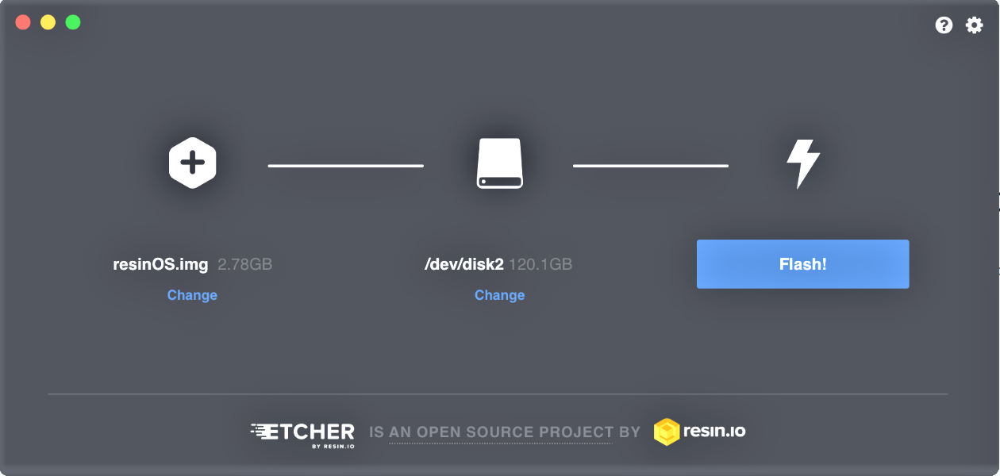
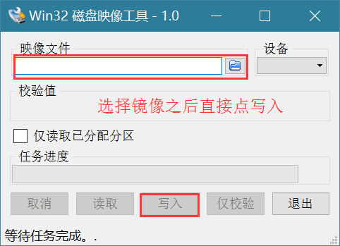

# Raspberrypi 树莓派

### [下载](https://www.raspberrypi.org/downloads/)

+ NOOBS

+ RASPBIAN

+ 其他

### 格式化及烧写系统

+ Linux 下

  使用 `gparted`格式化(`sudo apt-get install gparted` 安装)，格式化为 `FAT32` 格式

  

  先查看 SD 卡的文件格式，不是 FAT32 的需要格式化为 FAT32 ,安装 [etcher](https://github.com/resin-io/etcher#installers)

  

+ windows 下

  先查看 SD 卡的文件格式，不是 FAT32 的需要格式化为 FAT32 ,下载 [win32DiskImager](https://sourceforge.net/projects/win32diskimager/) 并安装 

  

+ macOS 下

  先查看 SD 卡的文件格式，不是 FAT32 的需要格式化为 FAT32 ,下载 [etcher](https://etcher.io/) 并安装

  

### 配置(以`RASPBIAN`为例)

+ 将镜像刷到 SD 卡之后，在 `boot` 目录下新建一个目录 `ssh` 

  2016.11.25日更新的系统默认不开启 `ssh` ，无显示器安装无法正常进行，解决方法就是在 `boot` 目录下新建一个目录 `ssh` 

+ 默认的用户名和密码

  用户名：```pi```

  密 码：```raspberry```

+ [Raspberrypi源](http://shumeipai.nxez.com/2013/08/31/raspbian-chinese-software-source.html) 改用国内的源加快下载安装软件速度

  ```bash
  $ sudo nano /etc/apt/sources.list
  注释掉每一行的代码（也就是在前面打 #），添加
    deb http://mirrors.ustc.edu.cn/raspbian/raspbian/ jessie main contrib non-free
  $ sudo apt-get update && sudo apt-get upgrade -y
  ```

+ `raspi-config` 配置

  ```bash
  $ sudo raspi-config
  ```
+ 常用软件

  ```bash
  aptitude
  htop
  vim
  tmux
  git
  python
  python-pip
  ```
+ [VNC 安装配置](https://www.raspberrypi.org/forums/viewtopic.php?t=74176)

+ [通过 RDP 协议远程连接 raspi]（http://www.xrdp.org/）

  ```bash
  $ sudo apt-get install xrdp  //安装 xrdp
  $ sudo reboot  //重启才能生效
  ```
  
  ubuntu 上的 rdp 客户端安装及设置
  
  ```bash
  $ sudo apt-get install rdesktop -y
  $ rdesktop -g 1265x728 192.168.1.108
  ```

+ 无线网配置

  ```bash
  $ sudo su - root  //切换至 root 用户，不然没有权限
  $ iwlist wlan0 scan | grep 'ESSID'  //查看 wifi 名称
  $ wpa_passphrase "wifi_name" "wifi_password" >> /etc/wpa_supplicant/wpa_supplicant.conf
  $ reboot  //重启后生效，可能要等待1分钟左右才能连接
  ```

### 安装 `jdk` 

### 安装 `tomcat`

### 安装 `mysql`


