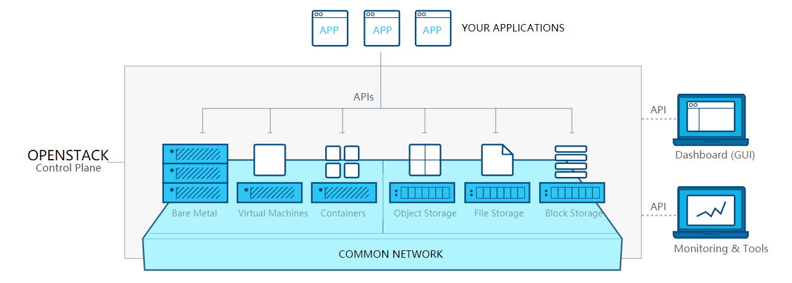

# OpenStack

## 前言

OpenStack 是一个由 NASA（美国国家航空航天局）和 Rackspace 合作研发并发起的，以 Apache 许可证授权的自由软件和开放源代码项目。OpenStack 是一个云操作系统，控制大量计算、存储和网络资源数据中心，都通过一个仪表板管理，使管理员控制，同时赋予其用户通过一个web界面来提供资源。

## 概述

基础架构即服务（IaaS）是指提供用于取消引用底层网络基础设施（如物理计算资源，位置，数据分区，扩展，安全性，备份等）的各种低级细节的高级API的在线服务。云操作系统中的虚拟机管理程序池可以支持大量虚拟机，以及根据客户不同需求上下扩展服务的能力。Linux 容器运行在直接在物理硬件上运行的单个 Linux 内核的隔离分区中。Linux cgroups 和命名空间是用于隔离，保护和管理容器的底层 Linux 内核技术。集装箱化比虚拟化提供更高的性能，因为没有管理程序开销。此外，集装箱容量可以通过计算负载自动调整，从而消除了过度供应的问题，并实现了基于使用的计费。IaaS 云通常提供额外的资源，例如虚拟机磁盘映像库，原始块存储，文件或对象存储，防火墙，负载平衡器，IP地址，虚拟局域网 VLAN 和软件包。IaaS 云提供商从安装在数据中心的大型设备库按需提供这些资源。对于广域连接，客户可以使用互联网或运营商云（专用虚拟专用网络）。为了部署其应用，云用户在云基础设施上安装操作系统映像及其应用软件。在此模型中，云用户修补和维护操作系统和应用软件。云提供商通常以公用事业计算为基础来计费 IaaS 服务：成本反映了分配和消费的资源数量。AWS EC2 就是一种典型的 IaaS，而 OpenStack 可以说是 AWS EC2 的开源实现，OpenStack 以其开源、免费、高效、灵活、可扩展等特性，成为现在云计算时代备受瞩目的宠儿，随着 OpenStack 子项目的逐渐成熟稳定，OpenStack 必将是未来 IaaS 层最好的解决方案。

## 架构

<h6 align="center"> OpenStack

## 组件

