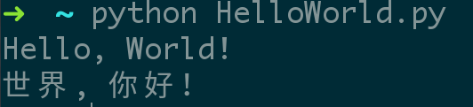

# Python

1.安装 `python`

```bash
$ sudo apt-get install python  // Debian/ubuntu
$ sudo yum install python  // CentOS
```

2.安装 `ipython`

```bash
$ sudo apt-get install ipython  //Debian/ubuntu
$ sudo yum install ipython  //CentOS
```

3.`pip`

+ 安装

```bash
$ sudo apt-get install python-pip  // Debian/ubuntu
$ sudo yum install python-setuptools  //CentOS
$ sudo easy_install pip  //CentOS
```

+ `pip` 使用

```bash 
$ pip install shadowsocks  // 安装
$ pip uninstall shadowsocks  //卸载
$ pip list  //列出安装的软件
$ pip show --files shadowsocks  //查看 shadowsocks 的下信息
$ pip list --outdated  //列出需要升级的软件
$ pip install --upgrade shadowsocks  //升级 shadowsocks 
$ 
```

4.编码 `utf-8`

```bash
#!/usr/bin/env python
# coding=utf-8

print "Hello, World!"
print "世界, 你好！"
```


